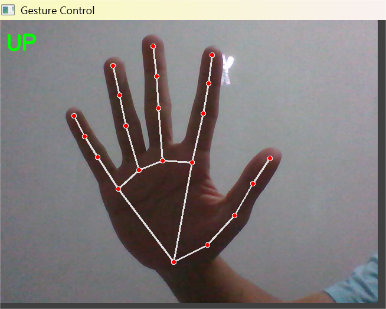

# Vision-Based Hand Gesture Recognition 🎮✋

[](https://www.python.org/)
[](https://creativecommons.org/licenses/by-nc-nd/4.0/)
[](https://youtu.be/fdoTDal46xY?si=svoeNBQOFO4rglU0)

A **real-time hand gesture recognition system** that maps hand gestures to keyboard inputs, enabling **accessible game control**. Ideal for users with physical limitations or for creative game interaction.

---

## ✨ Features
- ✅ Real-time hand gesture detection using webcam  
- ✅ Gesture-to-key mapping: `↑`, `↓`, `←`, `→`, `Space`  
- ✅ Cooldown system to avoid accidental multiple key presses  
- ✅ Supports one-hand control  
- ✅ Lightweight and easy to integrate with games or applications  

---

## 🎬 Demo

[Watch Demo on YouTube](https://youtu.be/fdoTDal46xY?si=svoeNBQOFO4rglU0)  

**Screenshots:** See [Screenshots](assets/screenshots/)
 


---

## 🛠 Installation

** Clone the repository:

```bash

git clone https://github.com/colinwilson06/Vision-Based-Hand-Gesture-Recognition.git
cd Vision-Based-Hand-Gesture-Recognition
pip install -r requirements.txt
```

## 🚀 Usage

Run the Jupyter notebook:

```bash

jupyter notebook src/gestureToKeyboard.ipynb
```
- Ensure your webcam is connected.
- Perform gestures in front of the camera.
- Press Q to exit the application.

## ⚡ Requirements
- Python 3.8+
- opencv-python >= 4.7
- mediapipe >= 0.9
- pyautogui >= 0.9


## 📄 License
This project is licensed under [Creative Commons BY-NC-ND 4.0](https://creativecommons.org/licenses/by-nc-nd/4.0/).


**Note:** Folder `assets/` contains:
- `screenshots/` → sample gestures captured  
- `Tutorial Input System using Hand Gesture.mp4` → demo video (local copy)  
